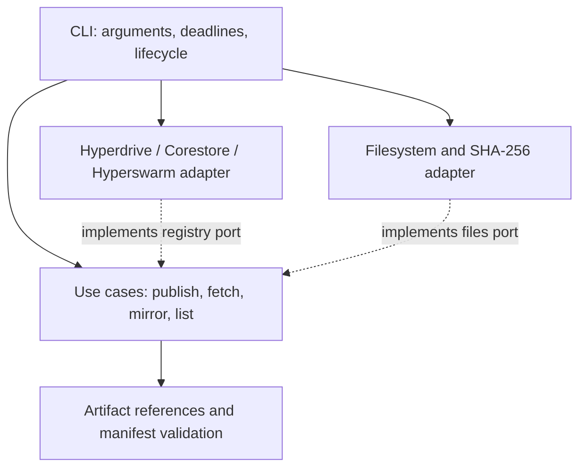

# relayjs: a private, peer-replicated artifact CLI

## Status

Accepted for a technical prototype. Implementation was explicitly requested; this does not establish market validation or production readiness.

## Context

A team should be able to publish an internal build once, fetch an exact version on another device, and obtain that same version from a replica when the original publisher is offline. The first demo must expose the value of peer replication without requiring package-manager compatibility, a web UI, or collaborative editing.

## Decision

Build `relayjs`, one strict TypeScript application compiled to Node.js ESM with a `relay` CLI entry point and three small boundaries. Use native Node APIs for argument parsing, hashing, files, and tests. Hyperdrive, Corestore, and Hyperswarm are required because actual peer replication is the purpose of the prototype. A Node CLI is the first delivery target; Pear/Bare packaging remains future work.

The CLI wires concrete adapters into use cases. Domain code imports no framework. Use cases accept plain objects and streams through ports rather than importing filesystem or networking implementations. There is no service framework, dependency-injection container, or generic repository hierarchy.

| Boundary | Responsibility |
| --- | --- |
| `src/domain/artifact.ts` | Safe exact references and manifest validation |
| `src/application/ports.ts` | Typed registry, file, stream, and cancellation contracts |
| `src/application/artifacts.ts` | Immutable publish, resolve, fetch, mirror, list |
| `src/infrastructure/files.ts` | Snapshot a regular file; stream hashing; verified export without overwrite |
| `src/infrastructure/registry.ts` | Persistence, signing-key ownership, device identity, trust, replication |
| `src/cli.ts` | Parse input, compose adapters, emit JSON, enforce deadlines, close resources |

## Data model

One state directory owns one registry membership and one device identity. The publisher's Corestore contains the registry writing keys; a joined device has read-only access to the registry. A device's Hyperswarm identity is distinct from the registry public key.

| Record | Fields / location |
| --- | --- |
| Local configuration | Schema version, registry public key, device keypair, trusted peer public keys |
| Artifact manifest | `schema: 1`, `name`, `version`, informational `filename`, byte `size`, `sha256` |
| Manifest path | `/artifacts/<name>/<version>.json` in Hyperdrive |
| Blob path | `/blobs/<sha256>` in Hyperdrive |

Names and versions are bounded safe path segments. Versions are exact opaque labels; there are no semantic-version ranges, mutable tags, or release channels yet. The CLI refuses to replace a name/version. The signing-key owner is trusted: these rules do not stop an owner from modifying storage using another program.

## Workflows and failure behavior

1. **Publish:** reject an existing version; snapshot and hash the source to avoid hashing one file state and uploading another; stream the snapshot into the registry; write its manifest last. A failure before the manifest commit cannot expose a new incomplete version. An orphan blob can remain after a failed publish.
2. **Fetch:** resolve an exact manifest from cache, synchronizing on a miss; validate it; stream its blob through byte-count and SHA-256 verification; make the verified temporary file visible using a same-filesystem hard link. An existing destination is preserved, including a symlink. Fetching also caches replicated blocks in Corestore.
3. **Mirror/seed:** read and verify an artifact into the replica cache, then stay online serving peers. Seed without an artifact serves the existing cache; it does not proactively mirror all versions.
4. **Availability:** a new download needs a reachable trusted peer with the required blocks. A complete cached artifact can be exported offline. A timeout bounds waiting for unavailable peers; retry can reuse previously cached blocks, but restarts the local output file.

## Trust model

Registry membership is discovered using the registry public key. It does not alone authorize a network transfer. Each device maintains an explicit public-key allowlist, checked before replication for incoming and outgoing connections. Peers must trust each other. Hyperswarm authenticates the remote key and encrypts transport; Hypercore verifies publisher-signed replication data. The manifest's SHA-256 additionally checks the exported bytes against the declared artifact.

Trust grants access to the entire registry, including history, rather than individual versions. Public keys must be exchanged over an authenticated channel. Authorized peers can redistribute copies; removing trust does not retract downloaded data or revoke another peer's trust decisions. Local state is protected by restrictive filesystem permissions, not application-level encryption at rest. Disk encryption and protecting the publisher's state remain operator responsibilities.

## Consequences

- One publisher avoids distributed write conflicts and ambiguous ownership of versions.
- Replicas can serve signed content without receiving publisher signing keys.
- The prototype provides no SSO, per-artifact permissions, blind encrypted hosting, key rotation, publisher recovery, automatic garbage collection, or package-protocol compatibility.
- Each running CLI owns its state directory; stop its seed process before using that same state for another command.
- Internet-free operation needs a deliberately configured local DHT bootstrap network. Public peer discovery does not establish an offline-LAN promise.
- Architecture assessment: **9/10** against the clean-architecture skill. Domain/use-case imports point inward; strict TypeScript now checks explicit port contracts and adapter implementations. An automated import-boundary check would strengthen this as the application grows.

## Verification

Acceptance requires real storage/replication tests alongside use-case tests: exact binary bytes, immutable versions, unauthorized connection denial, replica availability after publisher shutdown, cache persistence, corrupt-output rejection, timeout handling, and preserved destinations. See `bun run test` for the executable checks and the CLI guide for operational limitations.

## References

- [Hyperdrive](https://github.com/holepunchto/hyperdrive)
- [Hyperswarm](https://github.com/holepunchto/hyperswarm)
- [HyperDHT isolated network configuration](https://github.com/holepunchto/hyperdht)

## TypeScript build

`tsconfig.json` enables strict checking and NodeNext module resolution. Application and CLI sources live in `src/**/*.ts` and `bin/relay.ts`; `tsc` emits runnable JavaScript to ignored `dist/`. The npm executable points to `dist/bin/relay.js`, and the prepare lifecycle builds it for checkout/Git installs. Regression tests remain JavaScript and exercise the compiled production modules. `src/pear.d.ts` describes only the installed Pear APIs used here because those dependencies do not ship declarations. Network/file data enters as `unknown` and is validated before use.

## Bun tooling

Use Bun as the package manager and script runner with `bun.lock` as the single dependency lockfile. `bun run relay` explicitly launches Node.js, as does the executable shebang. The native locking dependency `fs-native-extensions` aborts inside Bun's unsupported `uv_get_osfhandle` on Bun 1.3.14 and 1.4.2 (Linux). Disabling locking would weaken the single-process storage guarantees, so runtime migration remains blocked; neither dependency locking nor file locking is bypassed. The tests continue to execute under Node.js via `bun run test`.
